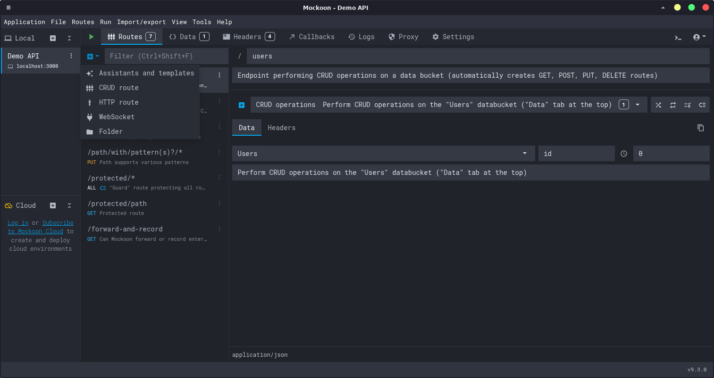
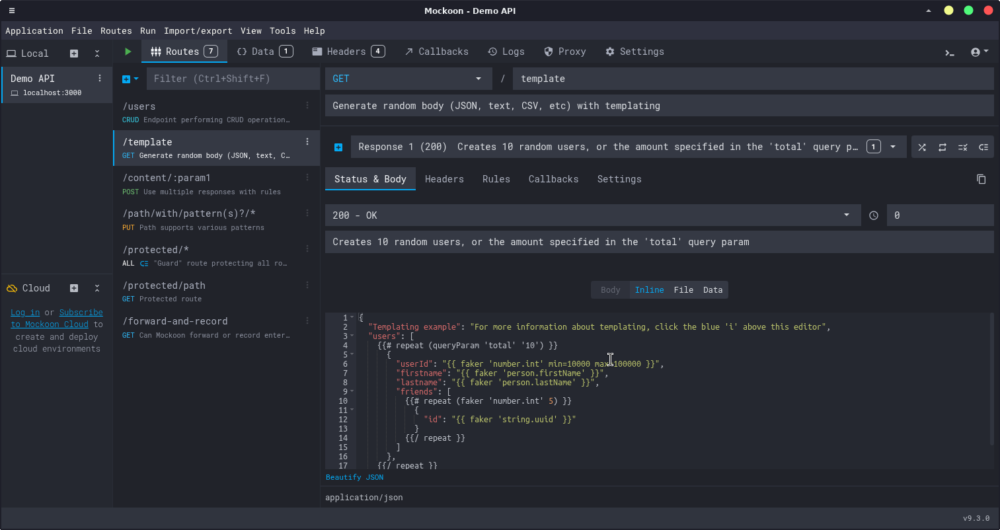

[Mockoon](https://mockoon.com) is a free, open-source tool that allows you to create and run mock REST APIs locally in seconds. With it, you can:
- Create unlimited mock REST APIs locally with no account required.
- Simulate errors, latency, and complex API behaviors.
- Speed up both frontend and backend development by removing dependencies.
- Share your mock environments with your team (via JSON files or the optional Mockoon Cloud).

It’s available as a cross-platform **desktop app, a CLI tool, and a Docker image**.

---

## Installation

Mockoon is available for macOS, Windows, and Linux. You can download the application directly from the [official website](https://mockoon.com/download/).

### macOS (via Homebrew)
If you're on a Mac, the fastest way to install the desktop app is with Homebrew:
```bash
brew install --cask mockoon
```

### CLI (Optional)
For automation, scripting, or use in CI/CD pipelines, you can install the CLI tool globally via npm:
```bash
npm install -g @mockoon/cli
```

---

## Adding a Mock API

1.  Open the Mockoon app and click "New local environment".
2.  Select a local folder to save the environment json file.
3.  Add a new **route** by clicking the `+` icon. Set the path (e.g., `/users`).

    

4.  Configure the **response** in the right-hand panel:
    -   Set the HTTP status code (e.g., `200 OK`).
    -   Switch to the "Body" tab and paste your JSON response.
    -   Optionally, add headers in the "Headers" tab.

    

5.  Start the mock server by clicking the green ▶️ **Start** button at the top.
6.  That's it! Test your new endpoint in your browser or with a tool like `curl`. By default, the server runs on port `3000`, but this is easily configurable on the **Settings** tab.

```bash
# Your API is now live!
curl http://localhost:3000/users
```

---

## Powerful Advanced Features

Mockoon is simple to start with but packed with advanced features for realistic simulations:

-   **Dynamic Templating**: Use Handlebars syntax to generate dynamic and realistic data. Perfect for creating non-static responses.
    ```json
    {
      "id": "{{uuid}}",
      "name": "{{faker 'name.findName'}}",
      "email": "{{faker 'internet.email'}}",
      "createdAt": "{{now 'iso'}}"
    }
    ```

-   **Simulated Latency**: Add a delay to responses (e.g., 2000ms) to test how your service's timeout configurations and retry mechanisms behave.

-   **Rule-Based Responses**: Serve different responses based on request headers, query parameters, or body content. For example, you can return a `401 Unauthorized` error if an `Authorization` header is missing, or a `200 OK` if it's present.

-   **Proxy Mode**: Forward requests that don't match any of your mock routes to a real API. This is great for partially mocking a service while letting other calls pass through.

-   **Import/Export**: Quickly bootstrap an environment by importing an OpenAPI/Swagger specification.

---

## Conclusion

Mockoon is an essential tool for modern development workflows. Whether you're building a frontend without waiting for backend APIs, testing edge cases and error scenarios, or working offline, Mockoon provides a fast and flexible solution. Its rich feature set—from dynamic templating to rule-based responses—makes it suitable for both simple prototyping and complex integration testing.

Give it a try and see how much faster your development cycle becomes!
