This guide provides step-by-step instructions for installing and configuring IBM MQ Explorer on macOS using the Eclipse IDE.

## 1. Install Eclipse IDE

You have two options for installing the Eclipse IDE:

*   **Using `brew` (Recommended):**

    Open your terminal and run the following command:

    ```bash
    brew install --cask eclipse-ide
    ```

*   **From the official Eclipse site:**

    Download the installer directly from the Eclipse website:
    [https://www.eclipse.org/downloads/packages/release/2025-06/r/eclipse-ide-eclipse-committers](https://www.eclipse.org/downloads/packages/release/2025-06/r/eclipse-ide-eclipse-committers)

## 2. Install IBM MQ Explorer in Eclipse IDE

1.  Launch Eclipse. From the main menu, navigate to **Help > Eclipse Marketplace**.

    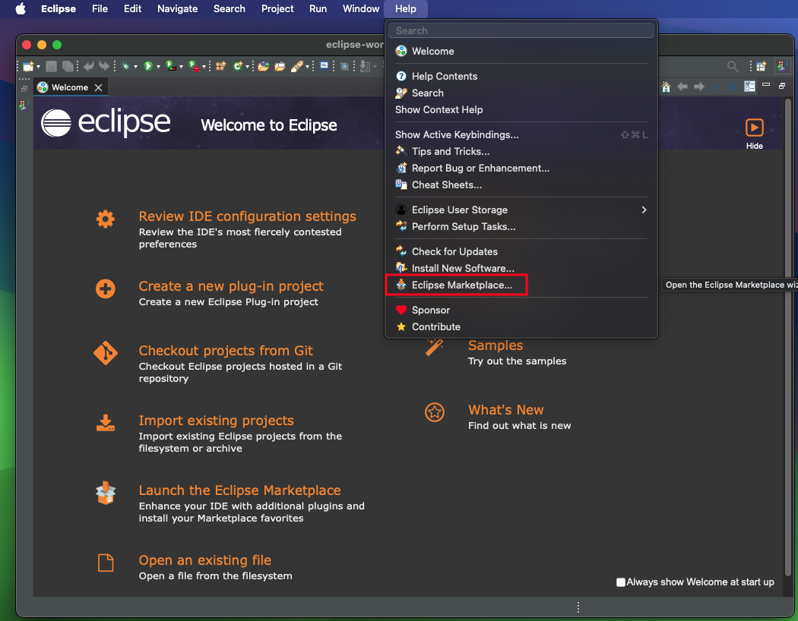

2.  In the Eclipse Marketplace window, search for "mq explorer" and click **Install** for "IBM MQ Explorer Version 9.4.1 9" (or the highest version available).

    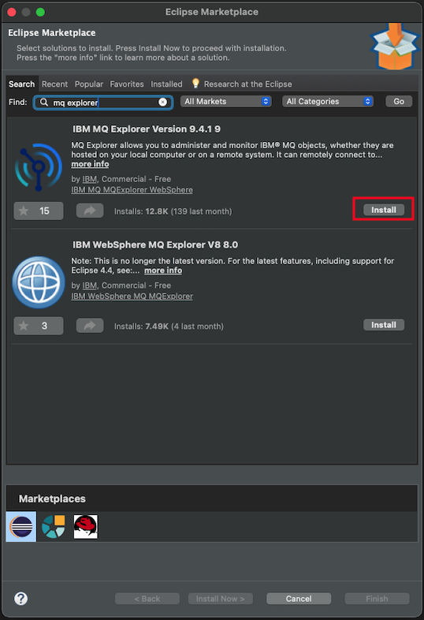

3.  Accept the license agreement to proceed.

    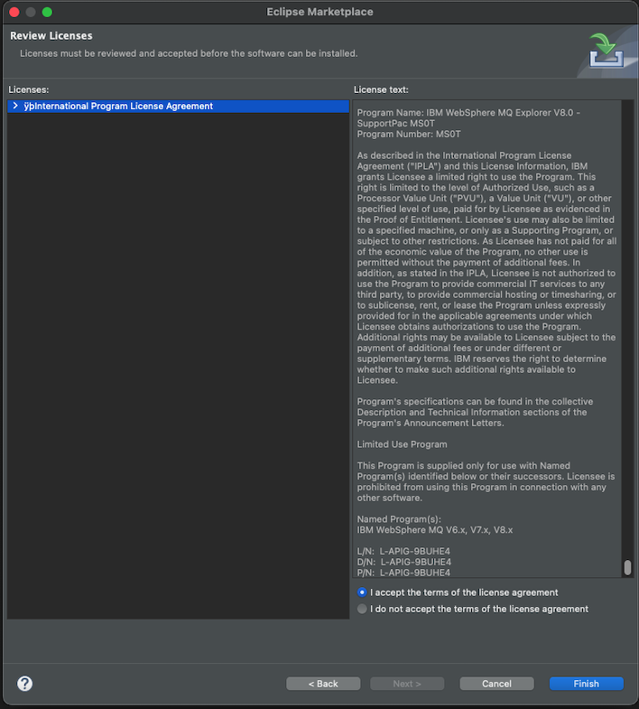

4.  The installation progress will be displayed.

    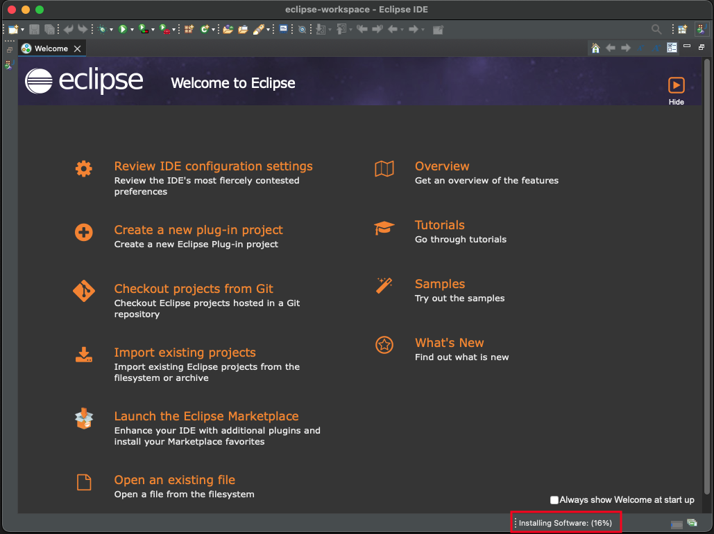

5.  A window will appear asking you to trust the content authorities. Click **Select All** and then **Trust Selected**.

    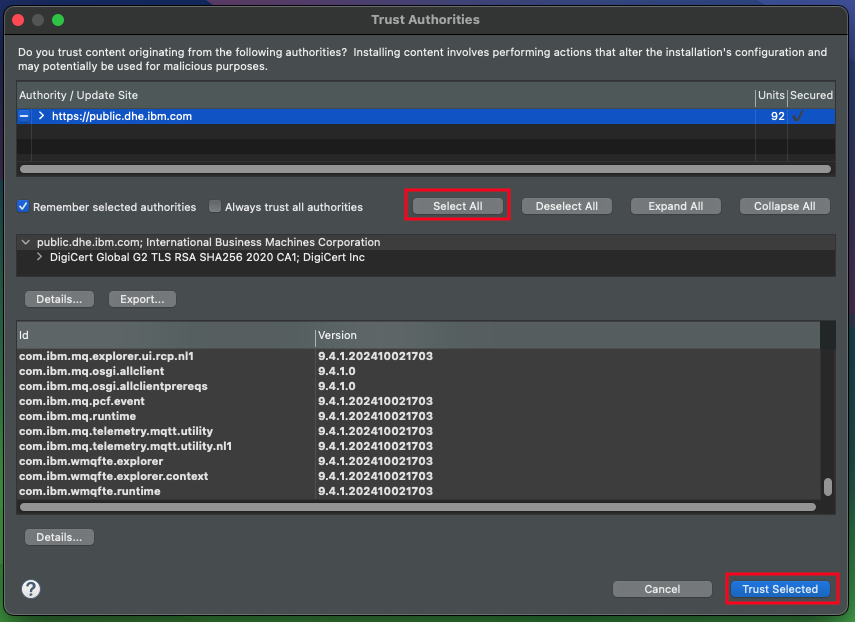

6.  A second window for trusting artifacts will appear. Repeat the previous step by clicking **Select All** and then **Trust Selected**.

    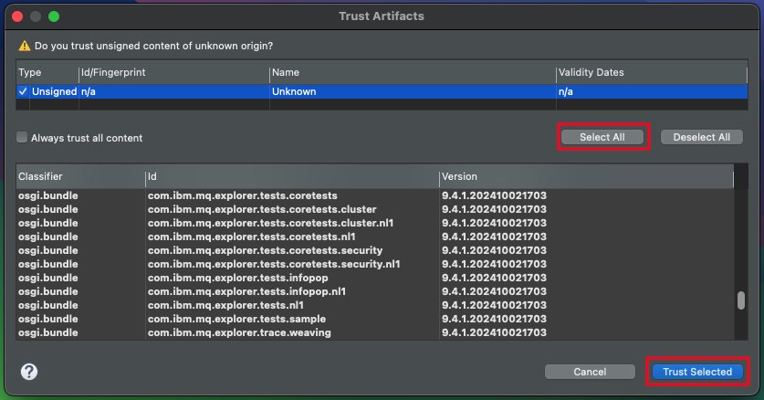

7.  Once the installation is complete, you will be prompted to restart the Eclipse IDE. Click **Restart Now**.

    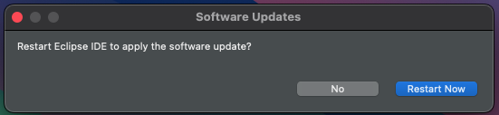

## 3. Open the IBM MQ Explorer Perspective

1.  From the main menu, go to **Window > Perspective > Open Perspective > Other...**.

    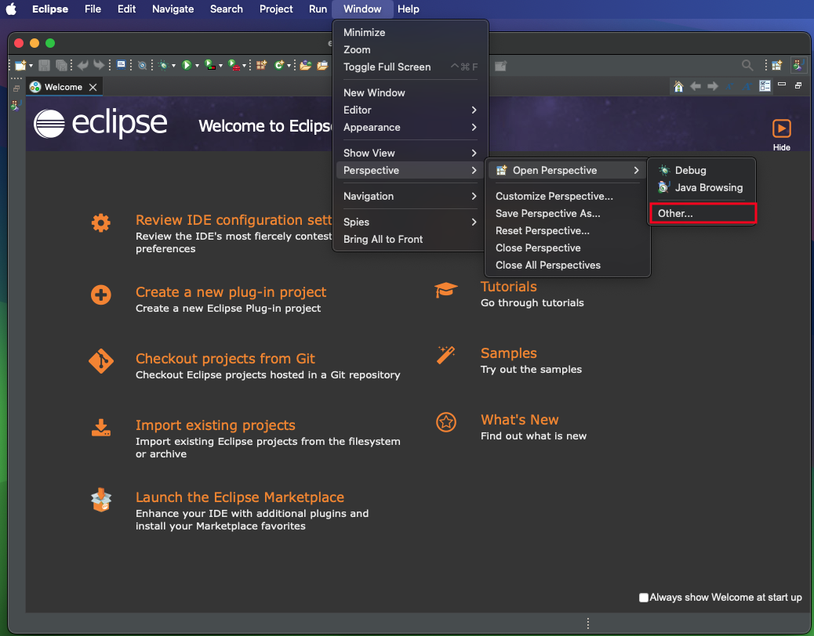

2.  Select **MQ Explorer** from the list and click **Open**.

    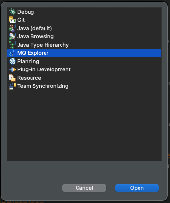

3.  The MQ Explorer perspective is now active. You can access it directly from **Window > Perspective > Open Perspective > MQ Explorer**.

    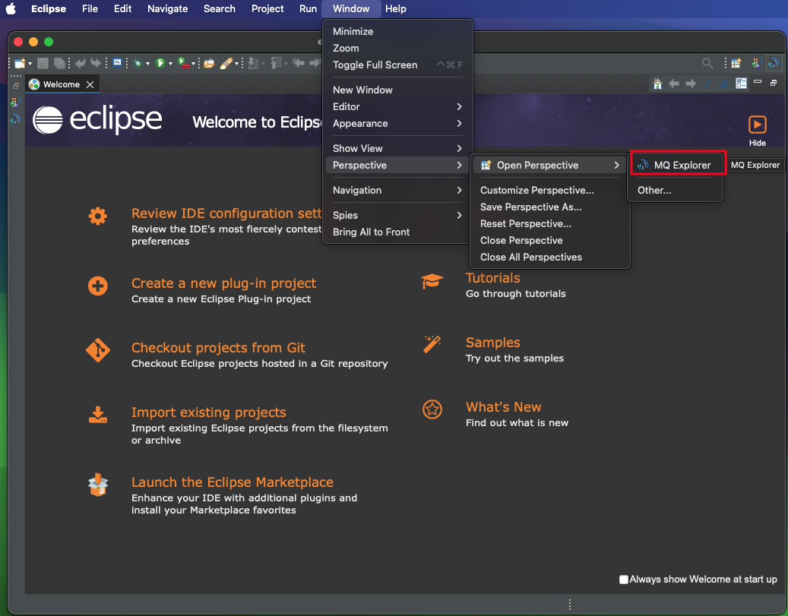

4.  Click the **Hide** icon on the Welcome screen to close it.

    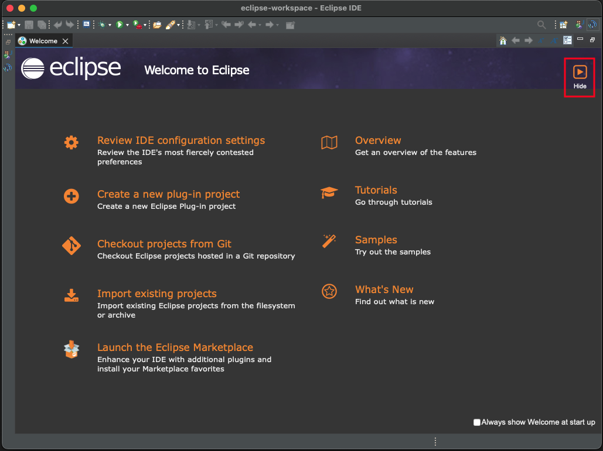

5.  You are now in the IBM MQ Explorer environment. ✅

    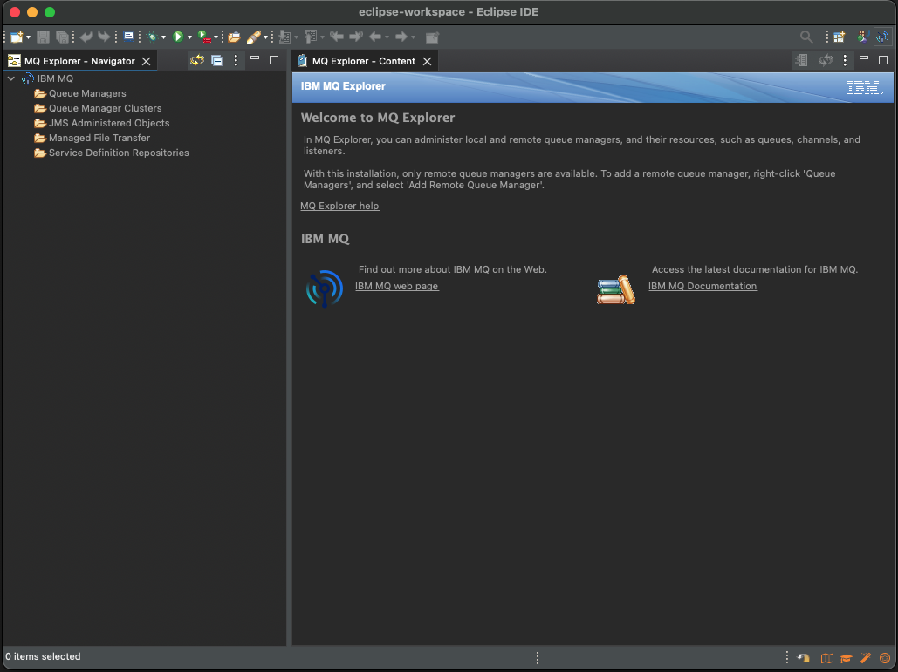

## 4. Import MQ Queues (from XML)

1.  In the MQ Explorer Navigator, right-click on **IBM MQ** and select **Import MQ Explorer Settings...**.

    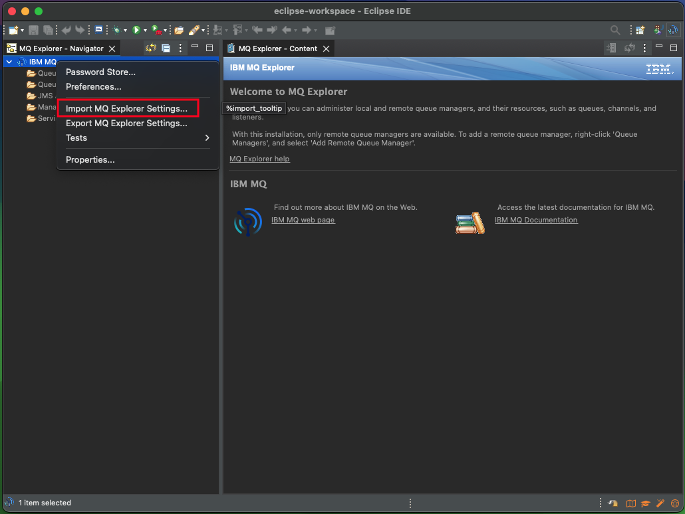

2.  Select **MQ Explorer Settings** and click **Next**.

    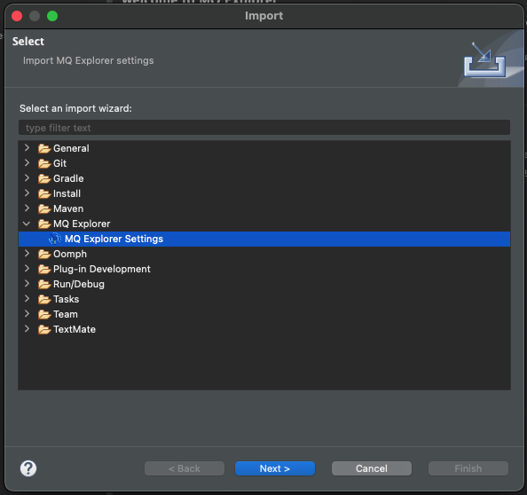

3.  Browse to and select the XML file containing your MQ queue configurations.

    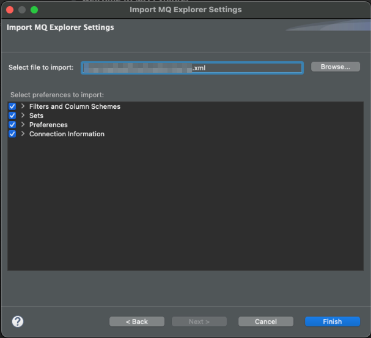

4.  A list of Gateways for accessing the MQ queues will be displayed.

    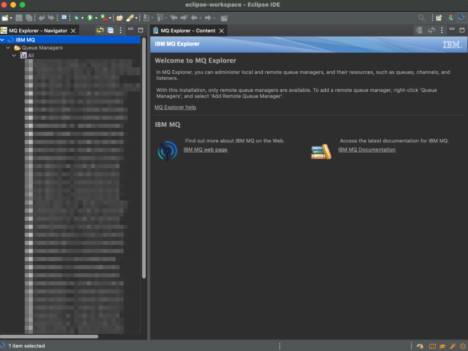

---

> Eclipse will automatically reopen the MQ Explorer perspective on startup if it was the last one you used.
